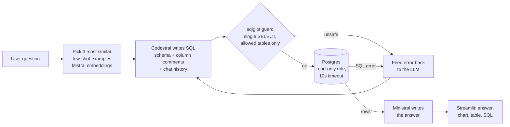
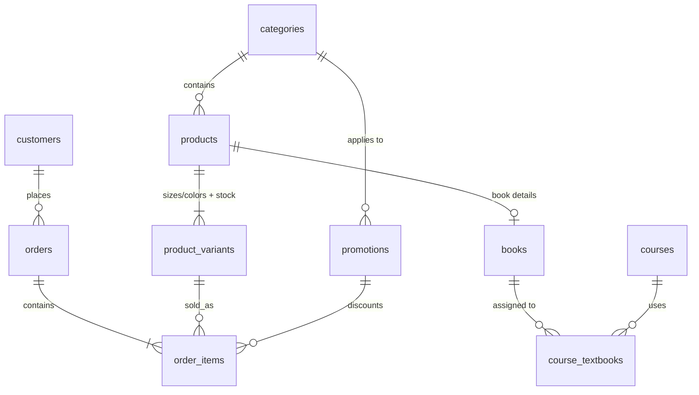

# Ask the IU Bookstore: an LLM-powered text-to-SQL assistant

Ask business questions about a store's data in plain English and get back an answer, the SQL that produced it, the
result table and a chart — no SQL knowledge needed.

**Stack:** Mistral AI (`codestral` for SQL, `ministral-14b` for answers, `mistral-embed` for retrieval) · LangChain ·
PostgreSQL on Supabase · Streamlit · sqlglot · pytest · GitHub Actions

**Highlights:** 94.4% execution accuracy on a 30-question benchmark (up from 77.8% zero-shot) · read-only,
injection-tested SQL execution · runs entirely on free tiers.

## What it does

Type a question like *"Which Luddy courses have the most expensive required textbooks?"* or *"How did game-day kiosk
sales compare between football seasons?"* and the assistant:

1. Writes a PostgreSQL query for it.
2. Checks that the query is safe to run.
3. Runs it against the database.
4. Replies in plain English, with the result table, an automatic chart and the SQL it used.

It handles follow-up questions ("What about Kelley?") and politely refuses questions the data can't answer ("What's
the weather in Bloomington?") or requests to change data ("Delete all refunded orders").

The data is a **synthetic Indiana University Bookstore**: textbooks tied to real IU course codes, Hoosier apparel in
sizes and colors (t-shirts, hoodies, jerseys, jackets), merchandise, flags and banners, 3,000 customers and about 8,800
orders over two years. Sales follow realistic seasons: textbook rushes in August and January, game-day kiosk spikes at
Memorial Stadium and Assembly Hall, Homecoming and Black Friday promotions, and graduation flag sales in May. All
names, prices and sales are fictional.

## How we built it

- **Database.** PostgreSQL with 10 tables in their own `bookstore` schema, ready for Supabase. Every column has a
  comment describing allowed values and business rules (such as "exclude refunded orders"). The app reads these
  comments from Postgres and sends them to the LLM, so the schema documents itself.
- **Synthetic data.** A seeded Python generator, so the data (and the benchmark's correct answers) are identical every
  run. It models seasonal demand, promotion windows, students buying textbooks for their own school, and
  year-over-year growth. Data is bulk-loaded with Postgres `COPY` in about 15 seconds.
- **LLM pipeline (LangChain + Mistral AI).**
  - `mistral-embed` retrieves the 3 most similar examples out of 14 hand-written question/SQL pairs (dynamic few-shot
    prompting).
  - `codestral` writes the SQL from the schema, those examples and recent chat history.
  - `ministral-14b` turns the result into a short, readable answer.
  - If a query fails, the error is sent back to the model for up to 3 attempts (self-correction).
- **Safety in layers.**
  1. Every query is parsed with sqlglot first: exactly one read-only `SELECT`/`WITH` statement, no dangerous
     functions, and only tables in the `bookstore` schema — so Supabase's `auth.users` and Postgres system tables are
     off-limits.
  2. The app connects as a read-only database role with a 10-second statement timeout, so even a query that slipped
     past the checker couldn't change anything.
- **Frontend.** A Streamlit chat app in IU crimson with sample questions, conversation history, and Chart / Data / SQL
  tabs.
- **Quality.** A 30-question benchmark with gold SQL scored by execution accuracy, and a 34-test pytest suite on GitHub
  Actions covering injection attempts, retry logic with a fake LLM, data integrity and the full UI flow.

## Database

| Table | Rows | What it holds |
| --- | --- | --- |
| `categories` | 4 | Books, Clothing, Merchandise, Flags & Banners |
| `products` | 152 | Every item sold: type, brand, fit, list price and supplier cost |
| `product_variants` | ~700 | Each size/color of a product, with stock on hand and reorder level |
| `books` | 61 | ISBN, author, publisher, edition and format for products in Books |
| `courses` | 30 | IU courses (e.g. CSCI-C 211, BUS-K 201) and their school |
| `course_textbooks` | 46 | Which books each course uses, and whether they are required |
| `customers` | 3,000 | Students, faculty/staff, alumni and visitors, with school and state |
| `orders` | ~8,800 | One per checkout: date, channel (In-Store, Online, Game Day Kiosk), payment, status |
| `order_items` | ~15,000 | One per receipt line: variant, quantity, price at sale, discount and line total |
| `promotions` | 15 | Yearly sales events (e.g. Homecoming Week, Black Friday) by category and date range |

**How discounts work.** A promotion applies a percentage off one category (or the whole store) between a start and end
date. Each order line placed during that window records the promotion and its discount, and Postgres computes
`line_total = quantity × unit_price × (1 − discount_pct / 100)` automatically. Revenue is `SUM(line_total)` over
completed orders, and savings are list price minus `line_total`.

## Challenges we ran into

- **MySQL vs. Supabase.** The original project used MySQL, but Supabase is PostgreSQL, so we moved the whole project to
  Postgres. We also had to disable psycopg's prepared statements, which break behind Supabase's transaction-mode
  connection pooler.
- **Free-tier model access.** Our free Mistral key allowed `mistral-small` **0 requests per minute**, so every call
  failed with "rate limited". Reading the rate-limit headers in Mistral's responses showed which models the key could
  actually use. We also found that LangChain's Mistral client doesn't retry rate-limit errors, so we added our own rate
  limiter and backoff retry.
- **Good at SQL, bad at summaries.** Codestral wrote correct SQL but misread its own results — it named a $95.99
  textbook as the most expensive when the top one was $253.99. We split the work: Codestral writes SQL, Ministral
  writes answers, and the answer writer sees earlier questions so follow-ups make sense.
- **Silent wrong answers.** The model guessed a promotion called "2025 Graduation Celebration" (it doesn't exist) and
  got an empty total with no error. The fix was documentation, not prompting: listing the real promotion names in the
  schema comments.
- **Unrepeatable results.** Even at temperature 0, Mistral's output varied between runs, so a single benchmark run
  swung between 90% and 97%. We added a `--repeats` option and report the average.
- **Not gaming the benchmark.** When the model mixed `AND`/`OR` without parentheses, we deliberately didn't add a prompt
  rule just to pass that question, so the score reflects how the system generalizes.

## Accomplishments that we're proud of

- **94.4% execution accuracy** averaged over 3 runs of 30 held-out questions, up from **77.8% zero-shot** — a measured
  16.6-point gain from dynamic few-shot retrieval.

  | Setup (`codestral-latest`, 30 questions × 3 runs) | Easy | Medium | Hard | Overall |
  | --- | --- | --- | --- | --- |
  | Zero-shot | 91.7% | 69.0% | 79.2% | 77.8% |
  | Dynamic few-shot (k=3) | 100% | 100% | 79.2% | **94.4%** |

- A security design that holds up: the test suite tries `DROP TABLE`, reading `auth.users`, `pg_sleep`, row locking
  and a `DELETE` hidden inside a `WITH` clause, and all of them are blocked.
- A realistic, explorable dataset built around our own university.
- Answers in about 3–4 seconds, running entirely on free tiers.

## What we learned

- **Schema documentation matters as much as the model.** Column comments listing allowed values fixed errors that
  prompt tweaks wouldn't.
- **Retrieving relevant examples is high-leverage.** Three similar examples improved accuracy more than any other
  change.
- **Use the right model for each job.** A code model and a general model each did better at their own task.
- **Measure, don't eyeball.** Good-looking demos hid real failures that only the benchmark caught — and one benchmark
  run wasn't enough.
- **Never trust LLM output with database access.** Validate the query, use a least-privilege role and set timeouts.
- **Read the API's response headers.** The rate-limit headers told us exactly what our key could do when the error
  message didn't.

## What's next for Ask the IU Bookstore

- **Deploy** the database on Supabase and the app on Streamlit Community Cloud from GitHub.
- **Fix multi-step logic errors** with a self-check step where the model reviews its SQL against the question before
  running it.
- **Compare models**, such as Defog's SQL-specialized SQLCoder and larger Mistral models on a paid plan.
- **Bring back "what-if" questions** by adding standing product discounts (e.g. "potential revenue if we sold all
  stock at today's prices").
- **Grow the benchmark** from 30 to 100+ questions, including harder date logic and multi-turn follow-ups.
- **Learn from users** with thumbs-up/down feedback, saving good answers as new few-shot examples.
- **Deeper analytics**, such as forecasting next semester's textbook demand and alerting on low stock.

---
